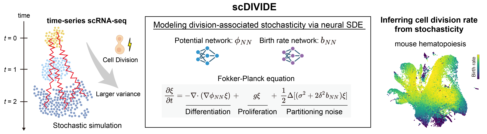

# scDIVIDE

scDIVIDE models developmental trajectories with growth-dependent diffusion stochastic differential equations and unbalanced optimal transport.

> Cite: Yasushi Okochi, Yoshihito Sawazaki, Yohei Kondo, and Honda Naoki, bioRxiv, 2026



---

## 1. Install dependencies first

Install the required packages before running `scDIVIDE`:

```bash
pip install torch torchsde POT
```

Please make sure each package is installed in an appropriate way for your environment (e.g. operating system and CUDA version).

`scDIVIDE` uses:
- [`torch`](https://pytorch.org/) for neural network training
- [`torchsde`](https://github.com/google-research/torchsde) for stochastic differential equation integration
- [`pot`](https://pythonot.github.io/) for optimal transport computations

---

## 2. Install scDIVIDE

You can install `scDIVIDE` from GitHub directory via `pip`.

```bash
pip install git+https://github.com/yasokochi/scDIVIDE.git
```

---

## 3. Basic Usage Example

```python
import torch
from scdivide import NeuralSDE, train_loop

func = NeuralSDE(
    in_out_dim=3,
    sigma=0.05,
    delta=0.1,
    alpha=0.5,
).to(device)

results = train_loop(
    func=func,
    data_train=data_train,
    integral_time=integral_time,
    device=device,
    train_config={"niters": 500, "num_samples": 400},
    optimizer_config={"lr": 1e-3},
)
```

See [`docs/configs.md`](docs/configs.md) for the full list of options.

> **Important:** scDIVIDE uses Sinkhorn divergence as the fitting loss. Please make sure the Sinkhorn iterations converge and adjust `sinkhorn_config` (e.g., `epsilon`, `n_iter`) if needed.
> For a complete runnable example, see [examples](examples/).

---

## 4. Example Notebook

A notebook example based on the synthetic three-gene dataset is included in this repository:

- `examples/three_gene_alpha05.ipynb`
- `examples/data/three_gene_scdivide_alpha05_data.csv`

---

## 5. Runtime Reference

Approximate `scDIVIDE` training time for 500 steps on a single NVIDIA A6000 GPU:

| Dataset | Time for 500 steps |
|---------|-------------------:|
| Three-gene (3D, 5 timepoints) | 790 s |
| Mouse hematopoiesis (50D, 3 timepoints) | 260 s |

These values are rough references derived from the benchmark by scaling the reported per-100-step runtime by 5.

---

## 6. Summary

| Item | Value |
|------|-------|
| Core framework | [PyTorch](https://pytorch.org/) |
| SDE solver | [torchsde](https://github.com/google-research/torchsde) |
| OT library | [POT](https://pythonot.github.io/) |
| Example | `examples/three_gene_alpha05.ipynb` |
| GitHub repository | `scDIVIDE` |

